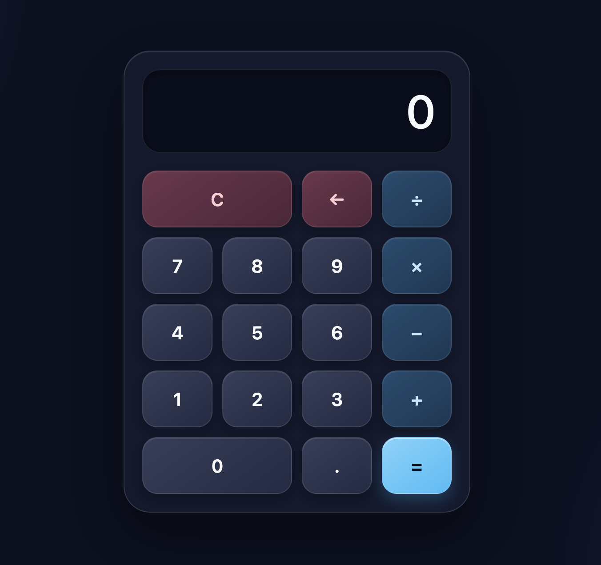

# 🧮 Calculator

A modern, responsive calculator built using **HTML5**, **CSS3**, and **Vanilla JavaScript**. The calculator performs basic arithmetic operations with a clean glassmorphism-inspired user interface.

## 📸 Preview



> Add a screenshot of your project and name it `preview.png` in the project folder.

---

## ✨ Features

- ➕ Addition
- ➖ Subtraction
- ✖️ Multiplication
- ➗ Division
- 🗑️ Clear (C) button
- ⬅️ Backspace/Delete button
- 📱 Fully responsive design
- 🎨 Modern Glassmorphism UI
- ⚡ Fast and lightweight
- 🌙 Dark theme interface

---

## 🛠️ Built With

- **HTML5**
- **CSS3**
- **JavaScript (ES6)**

---

## 📂 Project Structure

```
Calculator/
│
├── index.html
├── style.css
├── script.js
├── preview.png
└── README.md
```

---

## 🚀 Getting Started

### 1. Clone the Repository

```bash
git clone https://github.com/your-username/calculator.git
```

### 2. Open the Project

Simply open the `index.html` file in your browser.

No installation or dependencies are required.

---

## 💻 How It Works

- Users can click the calculator buttons to enter numbers.
- Arithmetic operators are stored until the second number is entered.
- Pressing `=` performs the calculation.
- `C` resets the calculator.
- `←` removes the last entered digit.

---

## 📱 Responsive Design

The calculator is optimized for:

- Desktop
- Laptop
- Tablet
- Mobile Devices

---

## 🎯 Future Improvements

- Keyboard Support
- Percentage (%)
- Square Root (√)
- Scientific Calculator Mode
- Calculation History
- Memory Functions (M+, M-, MR, MC)
- Theme Switcher

---

## 🤝 Contributing

Contributions are welcome!

1. Fork the repository
2. Create a new branch

```bash
git checkout -b feature-name
```

3. Commit your changes

```bash
git commit -m "Added new feature"
```

4. Push to GitHub

```bash
git push origin feature-name
```

5. Open a Pull Request

---

## 📄 License

This project is licensed under the MIT License.

---

## 👨‍💻 Author

**Abhirup Mukherjee**

GitHub: https://github.com/your-username

---

⭐ If you like this project, don't forget to star the repository!